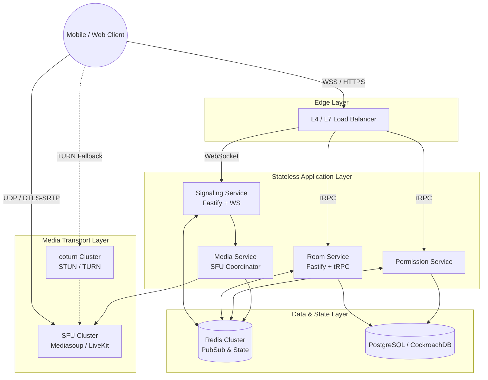
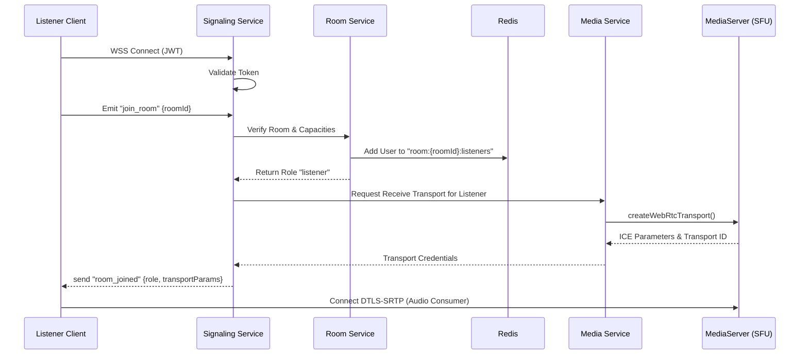
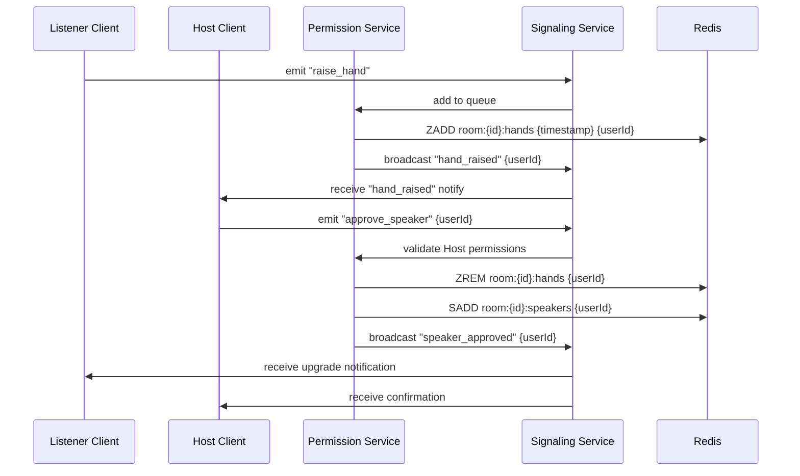
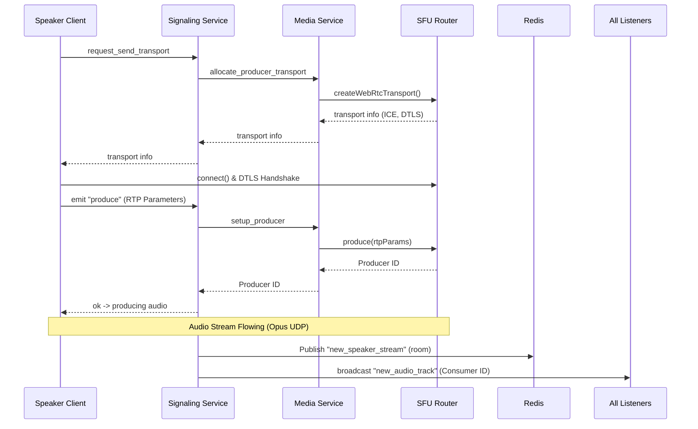

# Enterprise-Grade Group Audio Rooms Architecture

> **Target Scale:** 100M+ registered users, 10M+ concurrent WebSocket connections, 500K+ concurrent rooms, 10K+ listeners/room
> **Technology Stack:** Node.js, TypeScript, Fastify, tRPC, WebRTC (SFU via Mediasoup/LiveKit), Redis cluster, coturn, Kubernetes.

---

## 1. Detailed Backend Architecture Explanation

To achieve large-scale group audio rooms (similar to Twitter Spaces/Clubhouse), the system shifts away from P2P WebRTC to a **Selective Forwarding Unit (SFU)** model. An SFU acts as a centralized media router—speakers send their audio stream once to the SFU, and the SFU forwards it to all downstream listeners without heavy transcoding.

### Core Backend Services

- **Edge Layer / API Gateway (Envoy/Nginx):** Terminates TLS, handles WebSocket connections, and routes tRPC HTTP requests. It acts as a shield against DDoS and maps incoming sockets to stateless signaling nodes.
- **Signaling Service (Fastify + WS):** Highly available, fully stateless WebSocket servers handling low-latency event propagation (join, leave, reaction, request-to-speak). It relies on Redis Pub/Sub for cross-node event broadcasting.
- **Room Service (tRPC):** Manages room lifecycle (creation, deletion, metadata updates) and participant tracking. It updates the canonical room state in Redis.
- **Permission Service:** Centralized authority for RBAC operations (Raise Hand queue, Host approvals, speaker revocations).
- **Media Service (SFU Controller):** Manages a cluster of bare-metal or highly optimized compute nodes running **Mediasoup/LiveKit** worker processes. It auto-scales based on active WebRTC transports, orchestrates `Router` allocations, and handles ICE negotiation signaling.

---

## 2. Service Interaction Diagram



---

## 3. Signaling Event Sequence Diagrams

### 3.1 Room Join & Role Assignment Workflow



### 3.2 Listener "Request to Speak" (Raise Hand) & Host Approval



### 3.3 WebRTC Speaker Stream Publication



---

## 4. Scaling Strategy

Supporting 100M+ users requires elastic components categorized into stateless and stateful tiers:

1. **Horizontal Pod Autoscaling (Application Tier):**
   - The **Signaling Service** scales based on active socket connections (e.g., maximum 20k connections per pod). 
   - **Room Service / Permission Service** scales cleanly based on CPU/HTTP traffic.

2. **Redis Cluster (State & Event Tier):**
   - Use a sharded Redis cluster specifically dedicated to WebSockets and Pub/Sub routing.
   - Rooms are isolated via hashing strictly by `roomId`, ensuring all data (presence, hand raises, active speakers) for a specific room lives on the same Redis shard.

3. **SFU Cascading for Massive Rooms (>10k Listeners):**
   - Standard SFUs hit CPU bottlenecks handling thousands of egress audio streams for a single room. 
   - **Implementation:** Use **SFU Cascading (Tree Topology)**. A central "Origin SFU" hosts the 20 active producers/speakers. Origin SFU pipes these streams to "Edge SFUs" located cross-region. Listeners connect only to Edge SFUs.
   - A single Mediasoup worker can support ~500 concurrent audio consumers; 10k listeners require ~20 Edge Mediasoup workers automatically provisioned and piped from the Origin router.

4. **Multi-Region Traffic Routing:**
   - Geo-DNS resolves clients to the nearest data center. 
   - Coturn nodes scale based on regional traffic for strict symmetric NAT environments. (Note: Most connections will be direct to the public-facing SFU).

---

## 5. Database Schema Recommendations (PostgreSQL)

While Redis holds ephemeral room state, PostgreSQL serves as the persistent source of truth for user profiles, room schedules, blocks, and analytics.

```sql
CREATE TABLE users (
    id UUID PRIMARY KEY,
    username VARCHAR(255) UNIQUE NOT NULL,
    created_at TIMESTAMP DEFAULT CURRENT_TIMESTAMP
);

CREATE TABLE rooms (
    id UUID PRIMARY KEY,
    host_id UUID REFERENCES users(id),
    title VARCHAR(255) NOT NULL,
    status VARCHAR(50) DEFAULT 'SCHEDULED', -- SCHEDULED, ACTIVE, ENDED
    max_speakers INT DEFAULT 20,
    created_at TIMESTAMP DEFAULT CURRENT_TIMESTAMP,
    started_at TIMESTAMP,
    ended_at TIMESTAMP
);

CREATE TABLE room_participants (
    room_id UUID REFERENCES rooms(id),
    user_id UUID REFERENCES users(id),
    role VARCHAR(50) NOT NULL, -- HOST, SPEAKER, LISTENER
    joined_at TIMESTAMP DEFAULT CURRENT_TIMESTAMP,
    left_at TIMESTAMP,
    speaker_duration_seconds INT DEFAULT 0,
    PRIMARY KEY (room_id, user_id)
);
```

---

## 6. Redis Key Design

All real-time coordination operations run through a highly tuned Redis setup:

| Key Pattern | Data Structure | Description | TTL / Lifecycle |
| ----------- | -------------- | ----------- | --- |
| `room:{roomId}:info` | HASH | Core room state (hostId, status, maxSpeakers) | Drops 5m after end |
| `room:{roomId}:listeners` | SET | IDs of listening participants | Dropped on room end |
| `room:{roomId}:speakers` | SET | IDs of active/approved speakers | Dropped on room end |
| `room:{roomId}:hands` | SORTED SET | Raise hand queue (Score: timestamp) | Dropped on room end |
| `user:{userId}:socket` | STRING / HASH | Maps a user to their current WS pod ID | Tied to Session TTL |
| `pubsub:room:{roomId}` | CHANNEL | Redis pub/sub channel for room signaling | Ephemeral |

---

## 7. WebRTC Transport Flow

**Audio-First Configuration:**
Video support is omitted to maximize concurrent capacity per server. 
- **Codec:** OPUS exclusively, dynamic bitrate (16kbps – 64kbps) depending on RTCP feedback. 
- **Topology:**
  - **Uplink:** Up to 20 Speakers transmit a single UDP DTLS-SRTP audio stream to the room's SFU.
  - **Downlink:** Listeners receive a dynamically composed multiplexed stream (or multiple distinct audio tracks) from the SFU. Mediasoup manages `Consumer` endpoints for the participants.
  - **NAT Traversal:** The client attempts ICE gathering (`host`, `srflx`) connecting directly to the SFU's public IP. If blocked by symmetric corporate firewalls, clients fallback to CoTURN clusters (`relay`). 

---

## 8. Production Deployment Blueprint

### Infrastructure (Kubernetes)
1. **API / Edge Tier:** 
   - EKS/GKE cluster with Nginx Ingress or Envoy proxies.
2. **Stateless Services:** 
   - Node.js Fastify stateless pods managed via Horizontal Pod Autoscaler (HPA) targeting 70% CPU/Memory.
3. **SFU / Media Tier (Special Handling):**
   - Run SFU nodes as bare-metal or K8s DaemonSets with `hostNetwork: true` to bypass software-defined networking (e.g., Calico/Flannel overlay) latency and UDP port masking limits. 
   - Expose a wide UDP port range (e.g., 40000 - 49999) corresponding to Mediasoup WebRTC Server workers.
4. **Coturn Tier:**
   - Dedicated instances per region on high-bandwidth instances (e.g., AWS c6gn) scaling via CPU and active TURN allocation metrics.

### Observability
- **Metrics (Prometheus & Grafana):** Monitor Concurrent Users per Region, Redis CPU%, and Media Node Worker Load (packet loss, Jitter, audio levels).
- **Tracing (OpenTelemetry):** End-to-end tracing across Fastify/tRPC up to the database query layer.
- **Failover:** Deploy active-active across at least 3 regions. If a Media Node crashes, the front-end clients auto-retry reconnecting, and the Signaling Server will instantly provision a new webRTC transport on a healthy SFU node transparently.
