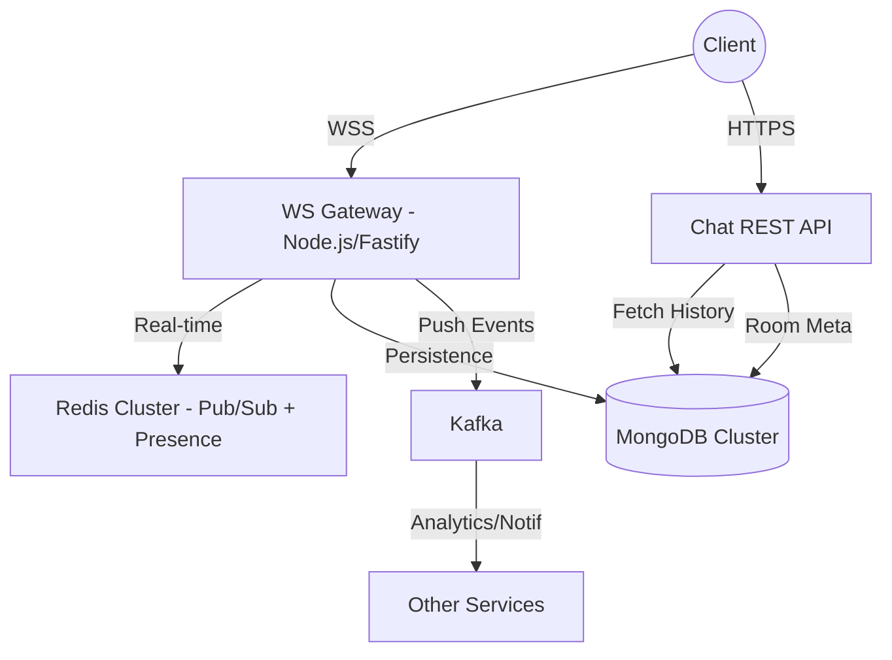

# FAANG-Level Chat Service Platform - Design Document

## 1. High-Level Architecture

## 2. Real-Time Architecture & Scaling
- **WebSocket Gateway**: Stateless horizontal scaling using `Redis Pub/Sub`. When a message is sent to a room, the gateway publishes the event to Redis. All instances subscribed to participating user channels receive and forward the message to connected sockets.
- **Connection Management**:
  - **Heartbeats**: 30-second ping/pong to identify and prune "zombie" connections.
  - **Presence**: Redis-based `presence:{userId}` keys with 60s TTL. Heatbeats renew this TTL.
- **Scaling to 100M+**:
  - **NLB (Network Load Balancer)**: Handles millions of long-lived TCP connections.
  - **Sharded Redis**: Distributed Pub/Sub channels to avoid single-node bottlenecks in large groups.

## 3. Message Persistence (MongoDB)
- **Schema**: Optimized for write-heavy workloads and time-series history fetching.
- **Indexing**: Compound index on `(roomId, createdAt: -1)` ensures $O(\log N)$ retrieval for chat history.
- **Ordering**: MongoDB `_id` or a custom `Snowflake ID` ensures strict causal ordering within a conversation.

## 4. Presence & Typing Indicators
- **Typing States**: **Pure Ephemeral**. Broadcasted via Redis Pub/Sub only. No DB writes to save IOPS.
- **Read Receipts**: Implemented as "Read Watermarks" (`lastReadAt`) in `ParticipantState` collection to minimize per-message update overhead.

## 5. Global Scale Strategy
- **Multi-Region**: Users are routed to the nearest regional gateway.
- **Cross-Region Sync**: Redis Pub/Sub happens at the regional level. Kafka Mirrormaker synchronizes interactions across global Aurora/Mongo clusters for consistency.

## 6. Resilience & Failure Strategy
- **Redis Outage**: Fallback to DB-only polling or localized presence.
- **Gateway Crash**: Clients utilize exponential backoff to reconnect to a different healthy node.
- **Message Retry**: Client-side sequence numbers and ACK mechanisms prevent message loss.

## 7. Compliance & Security
- **JWT Identity**: Zero-trust validation on every WebSocket handshake.
- **Encryption**: TLS 1.3 in-transit; Field-level encryption for message content at rest.
- **GDPR**: Cascade deletion of messages and presence data upon account closure.
