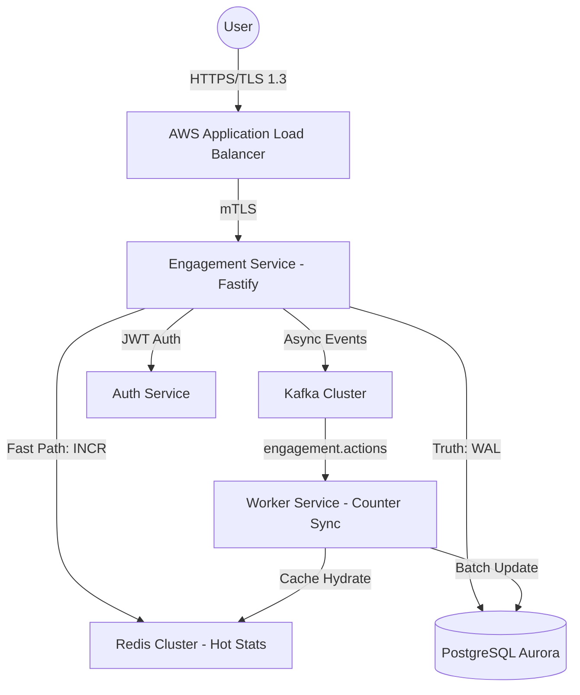

# FAANG-Level Engagement Service Design - Principal Review

## 1. High-Level Architecture

## 2. Engineering Tradeoffs

### Unified vs. Separate Services
- **Decision**: **Unified Engagement Service** for Likes, Reactions, and Reposts.
- **Reasoning**: At 100M users, the interaction patterns for these three are almost identical (high-volume increments, same attribution models). Shared infrastructure simplifies cross-feature consistency. **Comments** remain a separate module due to their higher storage depth and different retrieval patterns (threaded depth).

### Consistency Model
- **Decision**: **Eventual Consistency** for counters; **Strong Consistency** for the interaction record.
- **Reasoning**: It is acceptable if a Like count takes 500ms to update globally, but a user must not be able to "Double Like" a post. The interaction record is protected by a composite unique key (userId, targetId).

## 3. Real-Time Counter System (Redis)

### Key Schema
| Key | Type | Description |
| :--- | :--- | :--- |
| `engagement:stats:{targetId}` | Hash | Stores `likes`, `comments`, `reposts`, and `react:{type}` fields. |
| `lock:like:{userId}:{targetId}` | String | Short-lived (100ms) distributed lock to prevent double-submit races. |

### Mitigation for Hot Partitions (Viral Content)
For the top 0.1% of posts, we use **Redis Read Replicas** for stats retrieval and implement **Local Aggregation** (Service-side buffer) for writes before flushing to Redis to reduce network IO.

## 4. Scaling Roadmap (1M -> 100M)

| Stage | Strategy |
| :--- | :--- |
| **Growth (1M)** | Single Redis instance, Postgres with read replicas. |
| **Scale (10M)** | Redis Cluster (sharded by `targetId`), Kafka for async DB writes. |
| **Enterprise (100M)** | Multi-region Aurora Global, Hash-based partitioning for Postgres, Cell-based architecture to isolate failures. |

## 5. Security & Compliance Checklist

- [x] **Idempotency**: Every engagement API requires an idempotent operation to prevent multi-clicks.
- [x] **Rate Limiting**: Sliding window per user (e.g., max 100 likes/min) to prevent bot-farming.
- [x] **GDPR**: Engagement records are linked to `userId` and are purged via Kafka cascade when a user deletes their account.
- [x] **Integrity**: Periodic reconciliation jobs (DB -> Redis) to fix counter drift.

## 6. Principal Risk Analysis

1. **Write Amplification**: High-frequency likes on a viral post causing DB lock contention.
   - *Mitigation*: **Counter Buffering**. We write to Redis immediately but buffer DB updates in Kafka, batching them into 5-second intervals.
2. **Redis Failover**: If Redis goes down, we fallback to reading stats from DB replicas with a significant latency trade-off.
3. **Double Counting**: Prevented by using the DB interaction record as the source of truth during reconcile.
