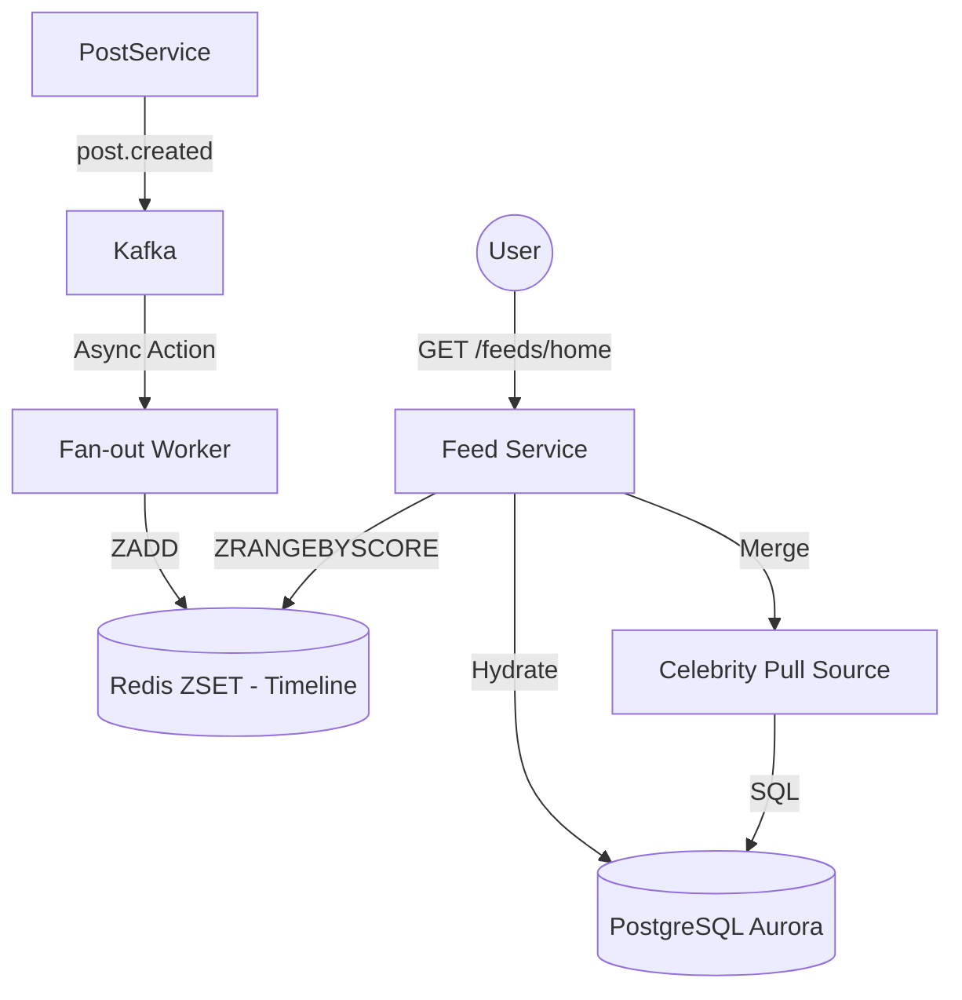

# FAANG-Level Feed Service Platform - Design Document

## 1. High-Level Architecture

## 2. Hybrid Fan-out Strategy
- **Fan-out on Write (Push)**: For users with < 50k followers. Posts are pushed to each follower's Redis ZSET at creation time.
- **Fan-out on Read (Pull)**: For "Celebrities" (> 50k followers). Posts are not pushed; instead, they are merged into the follower's feed at request time using a high-performance DB query or a separate "Celebrity Cache".
- **Reasoning**: Prevents "Write Amplification" where a single post from a celebrity could trigger 10M+ Redis writes, potentially crashing the cluster.

## 3. Tiered Ranking Algorithm
The ranking score is computed via a multi-signal function:
$$Score = (W_{recency} \times Decay(t)) + (W_{engagement} \times Velocity) + (W_{affinity} \times UserPairScore)$$
- **Decay**: Exponential 24h half-life.
- **Velocity**: (Likes + 2 * Comments) / (TimeSincePublish + 2).
- **Affinity**: Captured in `ranking_features` table based on historical interactions between the author and viewer.

## 4. Cache Tiering & Optimization
- **L1 (Redis ZSET)**: Stores the top 1,000 post IDs for each user, scored by the initial ranking.
- **L2 (Post Cache)**: Full post objects stored as JSON in Redis to avoid hydration DB calls for hot posts.
- **Feed Rebalancing**: Background workers periodically re-calculate scores in the ZSET when a post goes viral (high engagement velocity).

## 5. Scaling Roadmap (1M -> 100M)
- **1M Users**: Single region, standard ZADD fan-out.
- **10M Users**: Redis Cluster with sharding by `userId`. Introduction of the Hybrid Fan-out model.
- **100M Users**: Multi-region active-active deployment. Feed cache is localized to the user's nearest region. Cross-region follower fan-out handled via Kafka Mirrormaker.

## 6. Principal Risk Analysis
- **Redis Memory Explosion**: 100M users * 1000 IDs * 48 bytes $\approx$ 4.8 TB of RAM.
  - *Mitigation*: Implementation of **Inactive User Eviction** (TTL on feeds) and **LRU Eviction Policy**.
- **The "Thundering Herd" Problem**: Simultaneous refreshing of millions of feeds during major events.
  - *Mitigation*: **Staggered TTLs** and **Pre-computation** for recently active users only.
- **Consistency**: The cost of re-ranking engagement updates.
  - *Mitigation*: Only re-rank for posts with engagement velocity $> \sigma$ (threshold).

## 7. Compliance & Rights
- **GDPR**: `user_feed_metadata` and cached feeds are purged within 30 days of account deletion.
- **Right to be Forgotten**: Post deletion emits a `post.deleted` Kafka event which triggers a synchronous `ZREM` across all follower ZSETs in the region.
