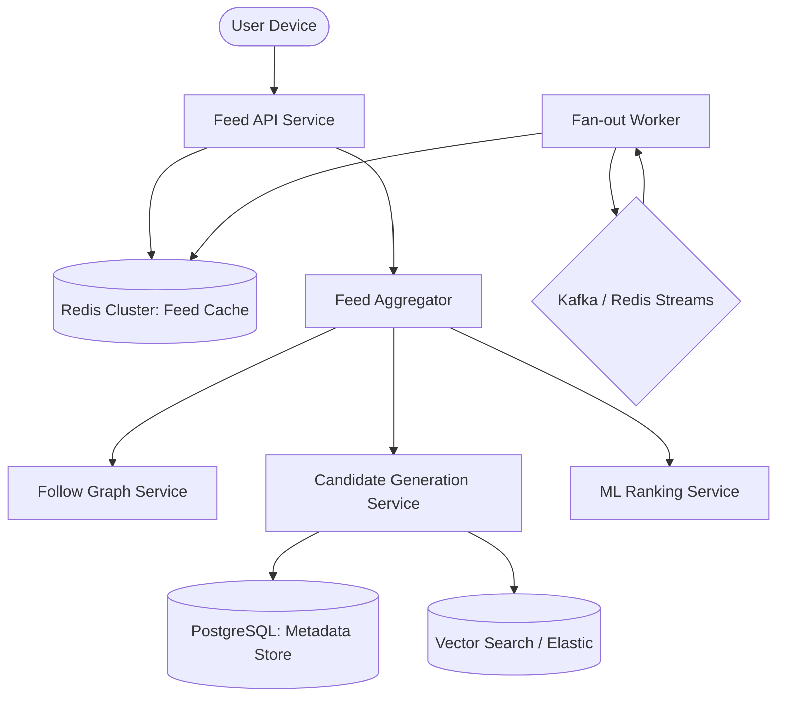

# 🏗️ Feed Segmentation System: High-Level Design (HLD)

**Status**: PROPOSAL  
**Author**: Principal Engineer (FAANG-level)  
**Target Scale**: 100M+ Users, 10k Reads/sec, 5k Writes/sec  
**SLA**: <150ms P95 Latency

---

## 1. Executive Summary
This document outlines the architecture for a globally distributed Feed Segmentation System. We transition from a monolithic "Home Feed" to a dual-stream architecture: **For You (Personalized/Discovery)** and **Following (Graph-based/Chronological)**. The system utilizes a hybrid Push/Pull fan-out model and a multi-stage ranking pipeline to ensure low-latency delivery while maintaining high relevance.

---

## 2. High-Level Architecture

### Core Components
1. **Feed API Service (Fastify)**: Entry point. Handles request validation, cursor management, and final filtering (blocks/mutes).
2. **Follow Graph Service**: Optimized for O(1) adjacency lookups using Redis Sets (`user:followings:{userId}`).
3. **Candidate Generation**: Retrieves 100-500 candidate posts per request (Followed users, Trending, Collaborative Filtering results).
4. **ML Ranking Service**: Heavy-weight scoring using feature vectors (User profile, Post engagement, Affinity scores).
5. **Fan-out Worker**: Asynchronous background processor for "Following" feed updates.

---

## 3. Data Storage Strategy

### A. PostgreSQL (Persistence)
- **`posts`**: Core metadata, ID, creator_id, visibility, content_hash.
- **`follows`**: Source of truth for graph. Indexed on `(follower_id, following_id)`.
- **`feed_metadata`**: User preferences, last seen cursors, feed versioning.

### B. Redis (Low Latency)
- **`feed:following:{userId}`**: Sorted Set (ZSET). `Score = published_at_timestamp`.
- **`feed:foryou:{userId}`**: Sorted Set (ZSET). `Score = ml_rank_score`.
- **`global:trending`**: Top 100 posts globally, updated via stream processing.
- **`user:followings:{userId}`**: Set (SADD). Fast lookup for blocked/muted users and graph checks.

---

## 4. Feed Generation Strategy

### A. Following Tab (Hybrid Fan-out)
- **Standard Users**: On post create, we push the `postId` to the Redis ZSET of all active followers (Fan-out on Write).
- **Celebrities (High Out-degree)**: We do **NOT** fan-out. At read-time, we pull celebrity posts and merge them with the ZSET (Fan-out on Read/Pull).
- **Optimization**: We only fan-out to "Active Users" (logged in within 30 days) to prevent zombie cache bloat.

### B. For You Tab (Multi-stage Pipeline)
1. **Candidate Generation**:
   - 40% Following Content (Recency)
   - 30% Recommendation (Vector Similarity)
   - 20% Trending (Velocity)
   - 10% Diversity (Exploration/New Accounts)
2. **Feature Enrichment**: Fetch user-post interaction history.
3. **Scoring**: Predictive models estimate $P(Like)$ and $P(Comment)$.
4. **Re-Ranking**: Apply business rules (Content deduplication, ad injection, safety filters).

---

## 5. Privacy & Filtering
- **Blocked/Muted Users**: Filtered at the API layer using a Bloom filter or the `user:blocks` Redis Set before returning results.
- **Private Accounts**: Checked during candidate generation.
- **Deduplication**: Content hashing prevents the same "viral" video from appearing twice with different IDs.

---

## 6. Performance & Scale
- **Cursor Pagination**: Uses `min_score` from Redis ZSETs to ensure stable paging even as new items are added.
- **Cross-Region Replication**: Feed caches are replicated to edge regions (US-East, EU-West, Asia-SE) to ensure <50ms local Redis RTT.
- **Event-Driven**: Kafka ensures that a spike in post creation doesn't block the API thread pool.

---

## 7. Failure Handling & Observability
- **Cache Miss**: If Redis is empty, we trigger a "Lazy Rebuild" from PostgreSQL (O(N) operation, capped at 200 items).
- **Graceful Degradation**: If the ML Ranking service is down, fall back to "Global Trending" or "Recency" ranking for the For You tab.
- **Metrics**: 
  - `feed_retrieval_latency` (P50/P99)
  - `cache_hit_rate`
  - `fanout_lag_seconds`
  - `ndcg_rank_accuracy` (for ML evaluation)
