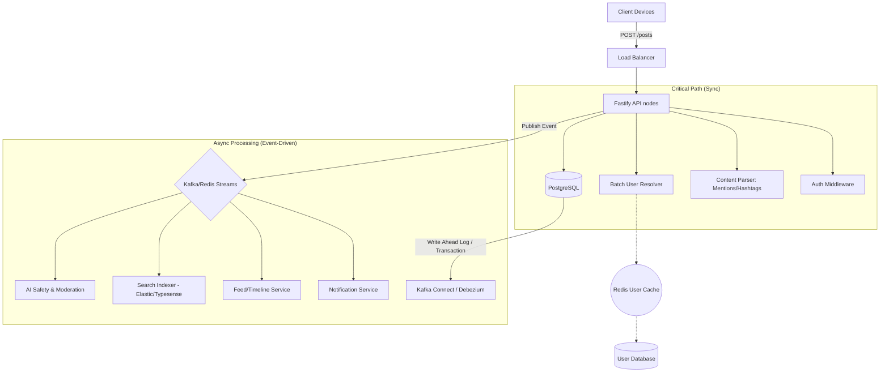

# 🚀 High-Performance Post Creation & User Mention System Design

## Principal Engineer Design — FAANG-grade Production System

---

## 1. System Architecture Overview

The system follows an **Asynchronous Event-Driven Architecture** to ensure high availability and low latency during the critical path of post creation.

---

## 2. Database Schema (PostgreSQL)

Designed for relational integrity while supporting high-concurrency mention lookups.

### `posts` Table
| Column | Type | Constraints | Description |
|--------|------|-------------|-------------|
| `id` | UUID | PRIMARY KEY | Unique post ID |
| `user_id` | UUID | REFERENCES users(id) | Author ID |
| `content` | TEXT | NOT NULL | Sanitized content |
| `privacy` | ENUM | PUBLIC, FOLLOWERS, PRIVATE | Visibility level |
| `status` | ENUM | DRAFT, PUBLISHED | Post status |
| `metadata` | JSONB | - | Rich text structural data |
| `created_at`| TIMESTAMP| INDEX | Creation time |

### `post_mentions` Table (The Core)
Mapping mentions allows for fast "Where was I mentioned?" queries.
| Column | Type | Constraints | Description |
|--------|------|-------------|-------------|
| `post_id` | UUID | REFERENCES posts(id) | The Post |
| `mentioned_user_id` | UUID | REFERENCES users(id) | The Mentioned User |
| `index_start`| INT | - | Metadata for UI highlighting |
| `index_end` | INT | - | Metadata for UI highlighting |
| `created_at`| TIMESTAMP| INDEX | For sorted "mentions of me" |

*   **Constraint**: `UNIQUE(post_id, mentioned_user_id)` prevents double-notifying the same user for one post.

### `hashtags` and `post_hashtags`
Normalized hashtag storage for trending analytics.

---

## 3. Post Creation Workflow

### Step A: Request & Idempotency
- Client sends `idempotencyKey` to prevent duplicate posts on retry.
- Fastify validates payload using Zod.

### Step B: The Parsing Pipeline (Mention Extraction)
- **Algorithm**:
  1. Sanitize HTML/Script tags to prevent injection.
  2. Use regex `/@([a-zA-Z0-9._]{1,30})/g` to extract candidate usernames.
  3. **Batch Resolution**: One SQL/Redis query to resolve `$N` usernames to User IDs.
  
### Step C: Privacy & Anti-Abuse
- **Validation**:
  - Filter out "Blocked" users (Author blocked them or vice versa).
  - Verify "Max Mentions" (e.g., 20) to prevent mass-spam.
  - Rate limit per-user (e.g., 50 mentions/minute) to prevent bot attacks.

### Step D: Atomic Transaction
1. Insert `post` record.
2. Insert `$N` `post_mentions` records.
3. Insert/Update `hashtags` & `post_hashtags`.

---

## 4. Async Event Fan-out (The FAANG Way)

Synchronous processing stops at Step D. Everything else is a background consumer.

1.  **Notification Consumer**:
    - Receives `POST_CREATED` event.
    - Filters: If `privacy == FOLLOWERS`, only notify mentions who follow author.
    - Sends push notification (FCM) + in-app update.
2.  **Timeline Consumer**:
    - Fan-out to followers' Redis timelines.
    - Inject into mentioned users' "Mention Feed".
3.  **Search Indexer**:
    - Push to Elasticsearch/Typesense for full-text and tag discovery.

---

## 5. Edge Cases & Failure Recovery

| Edge Case | Strategy |
|-----------|----------|
| **Username Change** | Mentions use immutable `userId`. Old text remains but links to new profile via dynamic hydration. |
| **Mention Removal on Edit**| Differentiate old vs. new mentions. Send "Cancel" event for removed, "New" for added. |
| **Private Account Mention**| System checks visibility relationship before triggering notification. |
| **Kafka Downtime** | Use **Transactional Outbox Pattern** - store events in a `outbox` table in the same DB transaction as the post, then relay to Kafka once online. |

---

## 6. Performance & Scalability

- **Resolution Latency**: <10ms by caching `username -> userId` mappings in Redis with short TTL (TTL expires on username change).
- **Concurrency**: Horizontal scaling of Fastify nodes. Partitioned Kafka topics by `authorId` to ensure event order.
- **Batching**: Bulk inserts for mentions to reduce DB round-trips.

---

## 7. Security Considerations

- **Injection**: content is stored as raw text but rendered via escaping or a structured JSON schema.
- **Enumeration**: Do not return "User Not Found" errors that allow attackers to probe valid usernames via the post endpoint. Fail silently for nonexistent users.
- **Spam**: Anomaly detection on mention graphs (e.g., mention of 20 random people who don't follow you).

---

## 8. Observability

1.  **Metric**: `post_creation_p99` (Target < 200ms).
2.  **Metric**: `mention_resolution_failure_rate`.
3.  **Alert**: If `events_lag > 5000` (Notification delay).
4.  **Trace**: Distributed tracing (Jaeger/Sentry) across API -> Kafka -> Notif-Service.

---

Designed for **The Antigravity Ecosystem** 🚀
