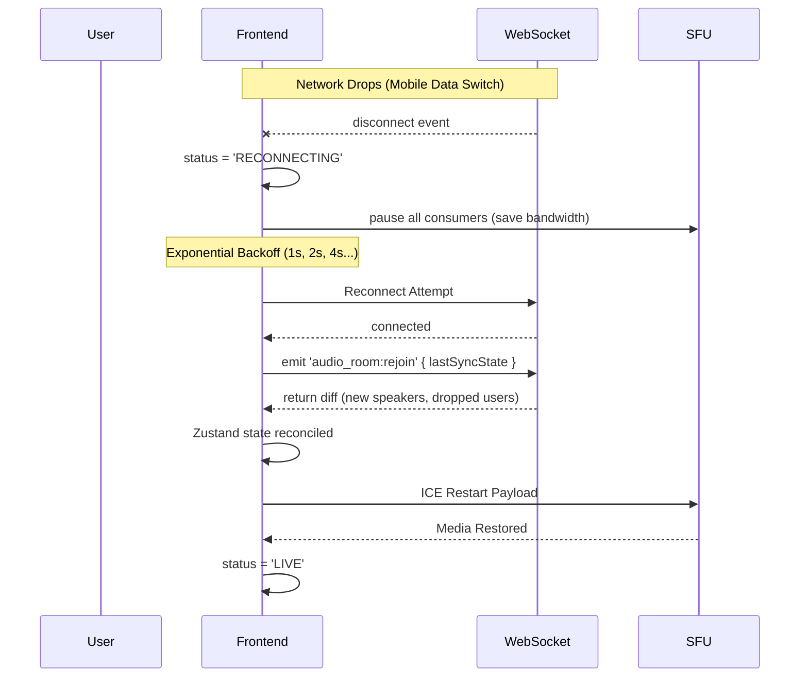

# Group Audio Rooms: Production-Grade Frontend Architecture Blueprint

> **Role & Perspective:** Principal Frontend Architect & Real-Time Communication Engineer
> **Objective:** Design the frontend foundation for a large-scale, low-latency, resilient Group Audio Rooms application (similar to Twitter Spaces / Clubhouse) scaling to millions of users and thousands of concurrent room listeners.
> **Tech Stack:** Next.js (App Router), TypeScript, TailwindCSS, Zustand, WebRTC, Socket.io (WSS).

---

## 1. Top-Level Folder Structure

For a clean separation of concerns, the frontend directory maps domains strictly. Since these rooms involve heavy WebRTC logic that shouldn't pollute the generic UI, we isolate the `audio-rooms` domain.

```text
/src
  /app
    /(dashboard)
      /spaces                  # Next.js App Router: Room Discovery Feed
        page.tsx
      /spaces/[roomId]         # Next.js App Router: Active Audio Room UI
        page.tsx
  /components
    /ui                        # Generic Shadcn/Tailwind generic components
    /audio-rooms               # Domain-specific Room Components
      /controls                # Audio Controls, Mic toggles
      /stage                   # Speakers Grid, Host Grid
      /audience                # Virtualized Listener list
      /modals                  # Raise Hand queues, Moderation panels
  /lib
    /webrtc                    # ⚡ WebRTC Audio Engine (SFU Adapter)
      MediasoupClient.ts
      AudioDeviceManager.ts
    /signaling                 # ⚡ WebSocket Gateway Managers
      SocketManager.ts
  /store
    /audio-room                # Zustand State Management
      useRoomStore.ts          # Tracks participants, raised hands, roles
      useAudioStore.ts         # Tracks mic states, streams, levels
      useSignalingStore.ts     # Tracks socket connection health
```

---

## 2. Component Architecture Breakdown

The Room UI needs to handle distinct layout priorities depending on the user's role and the volume of participants.

### `AudioRoomPage` (Wrapper)
The smart container. It initializes the WebSocket, negotiates the initial Room Join payload, fetches the current participant list from the tRPC/REST backend, and establishes the Mediasoup/LiveKit `Device` logic.

### `SpeakerStage` (High Priority Rendering)
Displays the Host and all Active Speakers (up to ~20).
- **Memoized**: Only re-renders when a speaker joins/leaves or their microphone mute state changes.
- **Audio Context**: Uses Web Audio API to calculate `AudioLevel` (voice activity) and applies an animated dynamic glowing ring (Tailwind: `ring-blue-500 animate-pulse`) when talking.
- **Typography**: Adheres to the clean sans-serif UI standard (e.g., `font-sans text-sm font-medium text-white` matching the DevAtlas aesthetic).

### `ListenerGrid` (Massive Scale Rendering)
Displays thousands of listeners. 
- **Virtualized**: Uses `react-window` or `@tanstack/react-virtual`. Rendering 10k standard React components will crash the browser thread. Virtualization ensures only the visible ~30 avatars are mounted in the DOM.

### `HostControlsPanel` & `SpeakerRequestQueue`
- **Queue**: A list of listeners who clicked "Raise Hand", sorted by chronologic order.
- **Host View**: Buttons to `Approve` (emits `approve_speaker` WS event), `Reject`, or `Mute All`. 

---

## 3. State Management Strategy (Zustand)

Using `Zustand` over React Context prevents cascading re-renders across the entire room when a single listener joins.

**`useRoomStore.ts`**
```typescript
interface RoomState {
  roomId: string | null;
  status: 'CONNECTING' | 'LIVE' | 'ENDED' | 'RECONNECTING';
  hostId: string | null;
  myRole: 'HOST' | 'SPEAKER' | 'LISTENER';
  speakers: Map<string, Participant>;
  listeners: Map<string, Participant>; // Map allows O(1) inserts/deletes
  raisedHands: string[]; // Queue of User IDs
  
  // Actions
  addParticipant: (p: Participant) => void;
  removeParticipant: (userId: string) => void;
  moveListenerToSpeaker: (userId: string) => void;
}
```

**`useAudioStore.ts`**
```typescript
interface AudioState {
  isMicMuted: boolean;
  producerId: string | null; // My WebRTC outgoing track
  consumers: Map<string, MediaStreamTrack>; // Incoming audio tracks
  audioLevels: Map<string, number>; // 0 to 100 for glowing rings
  
  // Actions
  toggleMute: () => void;
  addConsumer: (userId: string, track: MediaStreamTrack) => void;
}
```

---

## 4. WebRTC Integration Design (SFU Consumer model)

To prevent the user's browser from acting as an expensive SFU mixer, we utilize a single `Consumer` per speaker or a composited track, depending on the backend SFU strategy.

### `AudioEngine` Abstraction
```typescript
class AudioEngine {
  private device: mediasoupClient.Device;
  private sendTransport: mediasoupClient.Transport;
  private recvTransport: mediasoupClient.Transport;
  
  async init(routerRtpCapabilities) {
    this.device = new mediasoupClient.Device();
    await this.device.load({ routerRtpCapabilities });
  }

  // Called when role upgrades LISTENER -> SPEAKER
  async publishMicrophone() {
    const stream = await navigator.mediaDevices.getUserMedia({ 
      audio: { 
        echoCancellation: true, 
        noiseSuppression: true,
        autoGainControl: true
      } 
    });
    const track = stream.getAudioTracks()[0];
    const producer = await this.sendTransport.produce({ track });
    return producer;
  }
}
```
**Audio Rendering Trick**: Audio tracks are attached to hidden `<audio autoPlay />` elements in a `useRef` array hidden at the bottom of the DOM. No visible UI is bound to the actual media stream, entirely decoupling Media processing from React render cycles.

---

## 5. Signaling Event Flow Diagrams

### Reconnection Strategy & Network Resilience Flow


---

## 6. Performance Optimization Strategy

1. **Avoid `useSelector` anti-patterns:** 
   In Zustand, selecting the whole state `const state = useRoomStore()` ruins performance. 
   Instead: `const isMuted = useAudioStore(s => s.isMicMuted)`.
2. **Web Worker Audio Analysis:**
   Running `AnalyserNode.getByteFrequencyData()` for 20 speakers on the main thread every requestAnimationFrame (16ms) will stutter the UI. Offload raw audio track analysis to a `WebWorker` via `OffscreenCanvas` or simply pass a low-frequency data array back to the main thread via `.postMessage()`.
3. **Optimistic UI:**
   When the Host clicks "Approve Speaker" or a user clicks "Mute", locally update the avatar UI immediately before the WebSocket roundtrip finishes. Rollback on catch.
4. **Dynamic Imports:**
   ```tsx
   // Only load heavy SFU client libraries if user actually joins a room
   const MediasoupEngine = dynamic(() => import('@/lib/webrtc/MediasoupClient'));
   ```

---

## 7. Security & Edge Cases

- **"Unmute" Attacks**: Browsers strictly enforce that `<audio>` playback and `getUserMedia` require a direct human interaction event (`onClick`). Ensure the `publishMicrophone` pipeline starts directly from a user click.
- **Tab Throttling**: If a listener switches tabs, Chrome throttles `setInterval` and `requestAnimationFrame`. Use standard `WebSockets` combined with a `Worker`-based keep-alive ping to ensure the socket isn't closed by the backend for timeout.
- **Audio Device Swapping**: Listen to `navigator.mediaDevices.ondevicechange`. If a user unplugs Bluetooth earbuds, automatically fallback to the system default speaker without dropping the WebRTC peer connection.

---

## DevAtlas Typography & Aesthetics Note
To match the premium "DevAtlas" theme provided:
- **Backgrounds:** `bg-[#0f1419]` (Deep Dark) & `bg-[#161d24]` (Surface cards)
- **Typography:** Primary font family `Inter` or `Geist`. 
- **Font Weights:** Use `font-semibold` strictly for Display Names, `font-normal text-[#8b98a5]` for handles and timestamps.
- **Interactions:** Use subtle scaling `active:scale-95 transition-all` on Microphone/Raise Hand controls to give it a tactile app-like feel.
